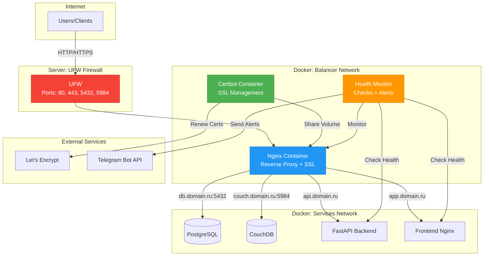
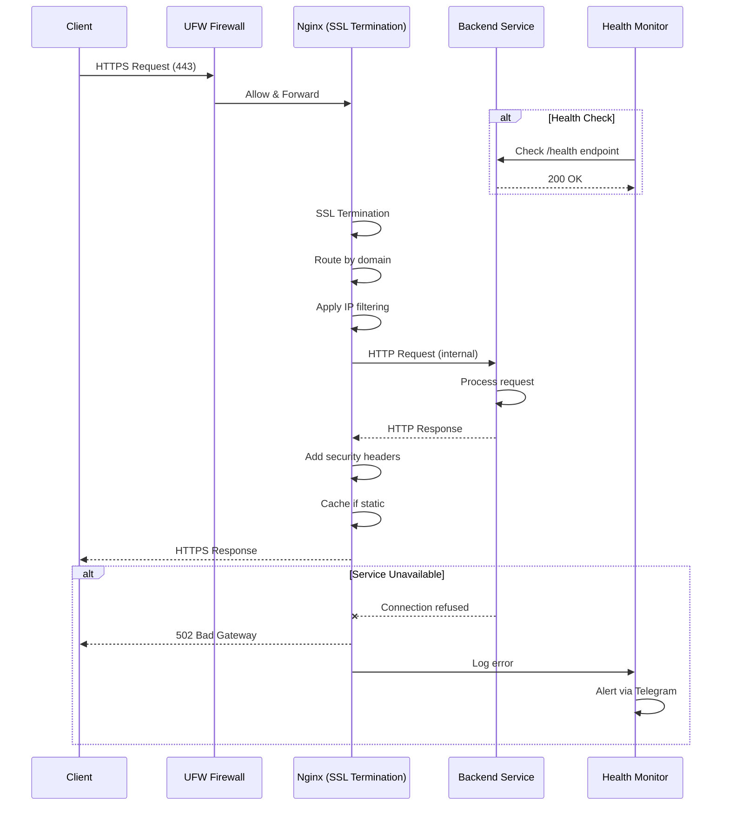
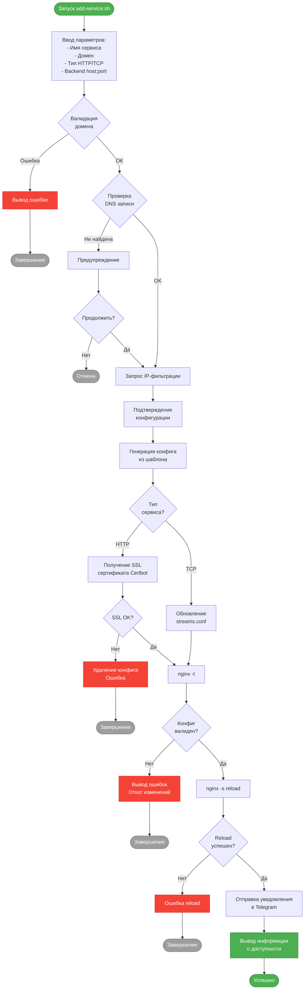
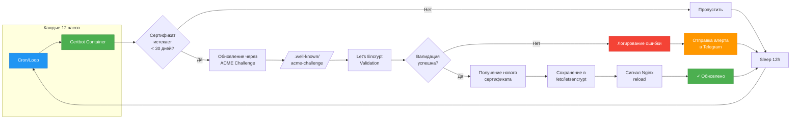
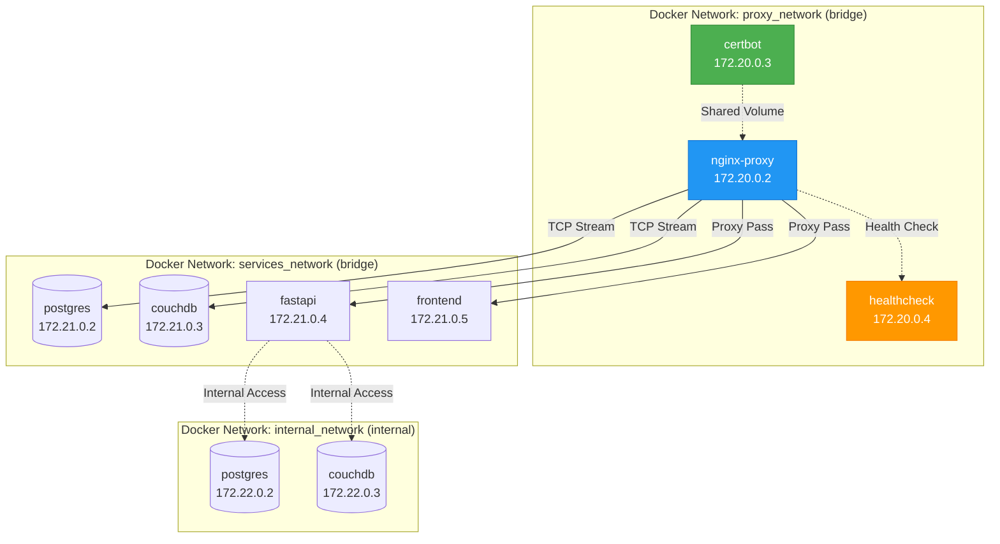
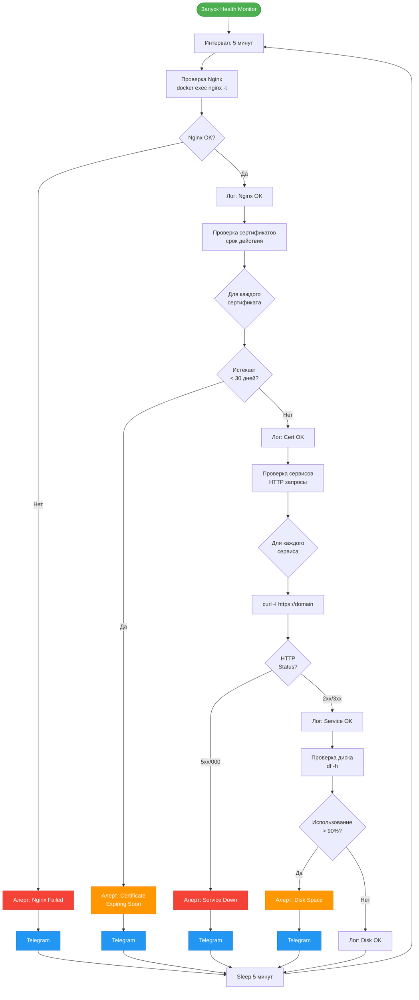

# 2. Архитектура системы

### 2.1 Общая схема

### 2.2 Поток обработки HTTPS запроса

### 2.3 Процесс добавления нового сервиса

### 2.4 Процесс обновления SSL сертификатов

### 2.5 Docker сети и взаимодействие

### 2.6 Система мониторинга и алертов

---

[◀ Назад к оглавлению](INDEX.md) | [Следующий раздел ▶](004_technical-requirements.md)
