# 1. Проблема дублирования контейнеров Nginx

## 1. Обзор архитектуры подключения

### 1.1 Проблема дублирования

**Текущая проблема:**
```
Client -> Nginx-Proxy -> Frontend-Nginx-Container -> Static Files
          (80MB RAM)      (80MB RAM)
```

**Оптимизированное решение:**
```
Client -> Nginx-Proxy -> Static Files (Direct Mount)
          (80MB RAM)
```

### 1.2 Типы подключения сервисов

```mermaid
graph TB
    subgraph "Тип 1: Proxy (Backend Services)"
        C1[Client] --> NP1[Nginx Proxy]
        NP1 --> BC1[Backend Container<br/>FastAPI/API]
        style BC1 fill:#FF9800
    end
    
    subgraph "Тип 2: Direct Static (Frontend)"
        C2[Client] --> NP2[Nginx Proxy]
        NP2 --> VM[Volume Mount<br/>/static/frontend1]
        style VM fill:#4CAF50
    end
    
    subgraph "Тип 3: Proxy Frontend Container"
        C3[Client] --> NP3[Nginx Proxy]
        NP3 --> FC[Frontend Container<br/>Nginx]
        FC --> FS[Static Files]
        style FC fill:#2196F3
    end
    
    subgraph "Тип 4: TCP Stream (Database)"
        C4[Client] --> NP4[Nginx Proxy<br/>TCP Stream]
        NP4 --> DB[(Database<br/>PostgreSQL/CouchDB)]
        style DB fill:#9C27B0
    end
    
    style NP1 fill:#F44336,color:#fff
    style NP2 fill:#F44336,color:#fff
    style NP3 fill:#F44336,color:#fff
    style NP4 fill:#F44336,color:#fff
```



### 1.3 Сравнение подходов

| Критерий | Proxy Container | Direct Static Mount |
|----------|----------------|---------------------|
| **Производительность** | Среднее (2 прокси) | Высокое (1 прокси) |
| **Потребление RAM** | ~160MB | ~80MB |
| **Сложность деплоя** | Средняя | Низкая |
| **Обновление контента** | Restart container | Copy files |
| **Изоляция** | Высокая | Средняя |
| **Hot reload** | Нет | Да (nginx reload) |
| **Рекомендация** | Для SSR, сложных SPA | Для статики, билдов |

---

[◀ Назад к оглавлению](INDEX.md) | [Следующий раздел ▶](102_updated-structure.md)
