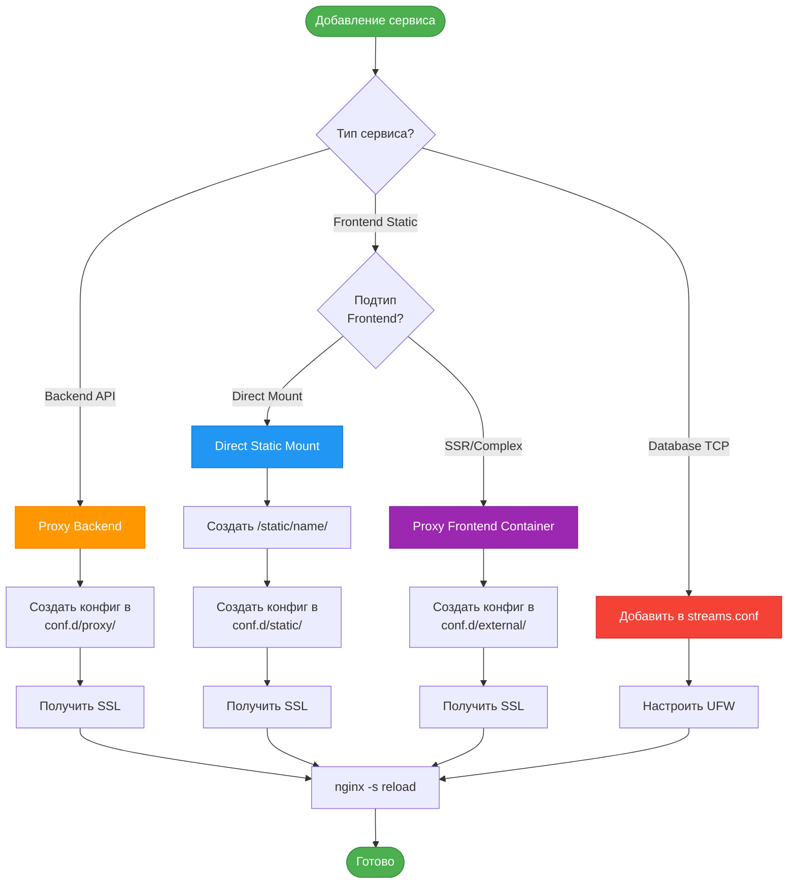

# 3. Типы подключения сервисов

## 3. Типы подключения сервисов

### 3.1 Классификация

### 3.2 Когда использовать каждый тип

| Тип | Использовать когда | Примеры |
|-----|-------------------|---------|
| **Proxy Backend** | API, динамический контент | FastAPI, Django REST, Node.js API |
| **Direct Static** | Статический билд, SPA | React build, Vue build, Angular dist |
| **Proxy Frontend Container** | SSR, сложная логика, кастомный nginx | Next.js, Nuxt.js, custom nginx configs |
| **TCP Stream** | Базы данных | PostgreSQL, MySQL, MongoDB, CouchDB |

---

[◀ Назад к оглавлению](INDEX.md) | [Следующий раздел ▶](104_direct-mount-configs.md)
