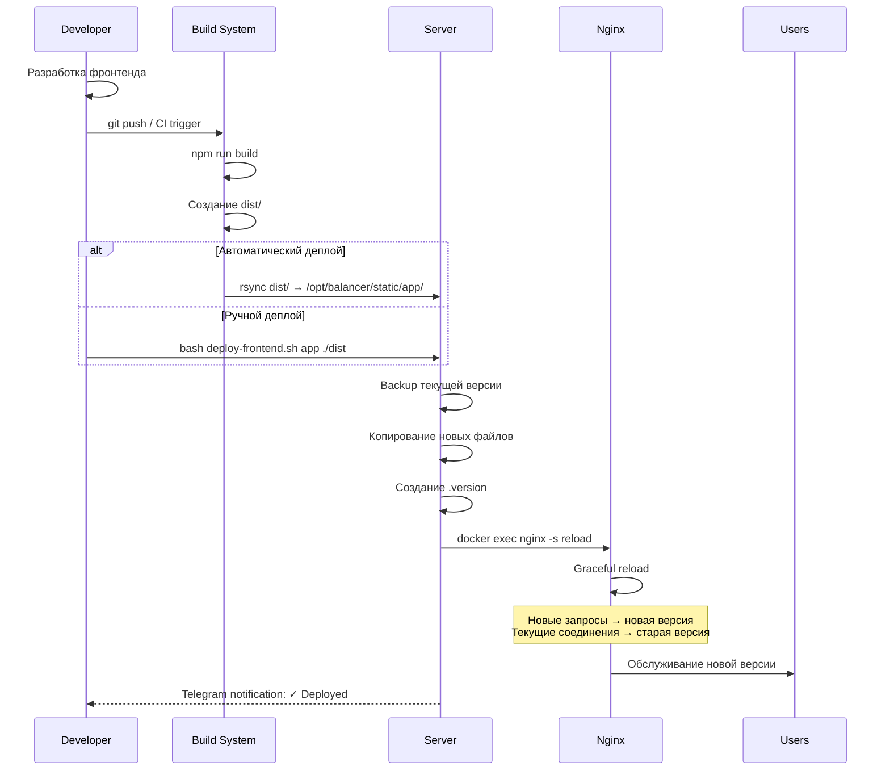

# 7. Процесс развертывания и работы

## 7. Workflow развертывания

### 7.1 Деплой Frontend Static

```bash
#!/bin/bash
# /opt/balancer/scripts/deploy-frontend.sh
# Скрипт для деплоя статического фронтенда

set -e

SERVICE_NAME=$1
BUILD_PATH=$2

if [ -z "$SERVICE_NAME" ] || [ -z "$BUILD_PATH" ]; then
    echo "Usage: $0 <service-name> <build-path>"
    echo "Example: $0 myapp ./dist"
    exit 1
fi

PROJECT_DIR="/opt/balancer"
STATIC_DIR="$PROJECT_DIR/static/$SERVICE_NAME"
DEPLOY_DIR="$PROJECT_DIR/deployments/$SERVICE_NAME"
TIMESTAMP=$(date +%Y-%m-%d_%H-%M-%S)
BACKUP_DIR="$DEPLOY_DIR/$TIMESTAMP"

echo "=== Frontend Deployment ==="
echo "Service: $SERVICE_NAME"
echo "Source: $BUILD_PATH"
echo "Target: $STATIC_DIR"

# Создание backup текущей версии
if [ -d "$STATIC_DIR" ]; then
    echo "Creating backup..."
    mkdir -p "$BACKUP_DIR"
    cp -r "$STATIC_DIR"/* "$BACKUP_DIR/"
    echo "✓ Backup created: $BACKUP_DIR"
fi

# Деплой новой версии
echo "Deploying new version..."
rsync -av --delete "$BUILD_PATH/" "$STATIC_DIR/"

# Создание .version файла
VERSION=$(git describe --tags --always 2>/dev/null || echo "$TIMESTAMP")
echo "$VERSION" > "$STATIC_DIR/.version"

echo "✓ Deployed version: $VERSION"

# Создание symlink на текущую версию
ln -sfn "$BACKUP_DIR" "$DEPLOY_DIR/current"

# Проверка Nginx конфигурации
echo "Testing Nginx configuration..."
docker exec nginx-proxy nginx -t

# Reload Nginx
echo "Reloading Nginx..."
docker exec nginx-proxy nginx -s reload

echo ""
echo "=== Deployment Complete ==="
echo "Version: $VERSION"
echo "Timestamp: $TIMESTAMP"
echo "Backup: $BACKUP_DIR"

# Очистка старых бэкапов (старше 7 дней)
find "$DEPLOY_DIR" -maxdepth 1 -type d -mtime +7 ! -name "current" -exec rm -rf {} \; 2>/dev/null || true

# Отправка уведомления
bash "$PROJECT_DIR/scripts/telegram-alert.sh" \
    "🚀 Frontend deployed\n\nService: $SERVICE_NAME\nVersion: $VERSION\nTime: $TIMESTAMP" \
    2>/dev/null || true

echo ""
echo "Test: curl -I https://<your-domain>"
```

### 7.2 Процесс разработки и деплоя



### 7.3 Откат (Rollback)

```bash
#!/bin/bash
# /opt/balancer/scripts/rollback-frontend.sh

SERVICE_NAME=$1
VERSION=$2  # Опционально: номер версии или "previous"

PROJECT_DIR="/opt/balancer"
STATIC_DIR="$PROJECT_DIR/static/$SERVICE_NAME"
DEPLOY_DIR="$PROJECT_DIR/deployments/$SERVICE_NAME"

if [ -z "$SERVICE_NAME" ]; then
    echo "Usage: $0 <service-name> [version]"
    echo "Example: $0 myapp previous"
    echo "Example: $0 myapp 2025-11-06_10-30-15"
    exit 1
fi

# Определение версии для отката
if [ -z "$VERSION" ] || [ "$VERSION" == "previous" ]; then
    # Найти предыдущую версию
    ROLLBACK_VERSION=$(ls -t "$DEPLOY_DIR" | grep -v "current" | sed -n '2p')
else
    ROLLBACK_VERSION=$VERSION
fi

ROLLBACK_DIR="$DEPLOY_DIR/$ROLLBACK_VERSION"

if [ ! -d "$ROLLBACK_DIR" ]; then
    echo "Error: Version $ROLLBACK_VERSION not found"
    echo "Available versions:"
    ls -1 "$DEPLOY_DIR" | grep -v "current"
    exit 1
fi

echo "=== Frontend Rollback ==="
echo "Service: $SERVICE_NAME"
echo "Rolling back to: $ROLLBACK_VERSION"
read -p "Continue? (yes/no): " confirm

[ "$confirm" != "yes" ] && exit 0

# Копирование версии
rsync -av --delete "$ROLLBACK_DIR/" "$STATIC_DIR/"

# Reload Nginx
docker exec nginx-proxy nginx -s reload

echo "✓ Rollback complete"

# Уведомление
bash "$PROJECT_DIR/scripts/telegram-alert.sh" \
    "⏪ Frontend rollback\n\nService: $SERVICE_NAME\nVersion: $ROLLBACK_VERSION" \
    2>/dev/null || true
```

---

