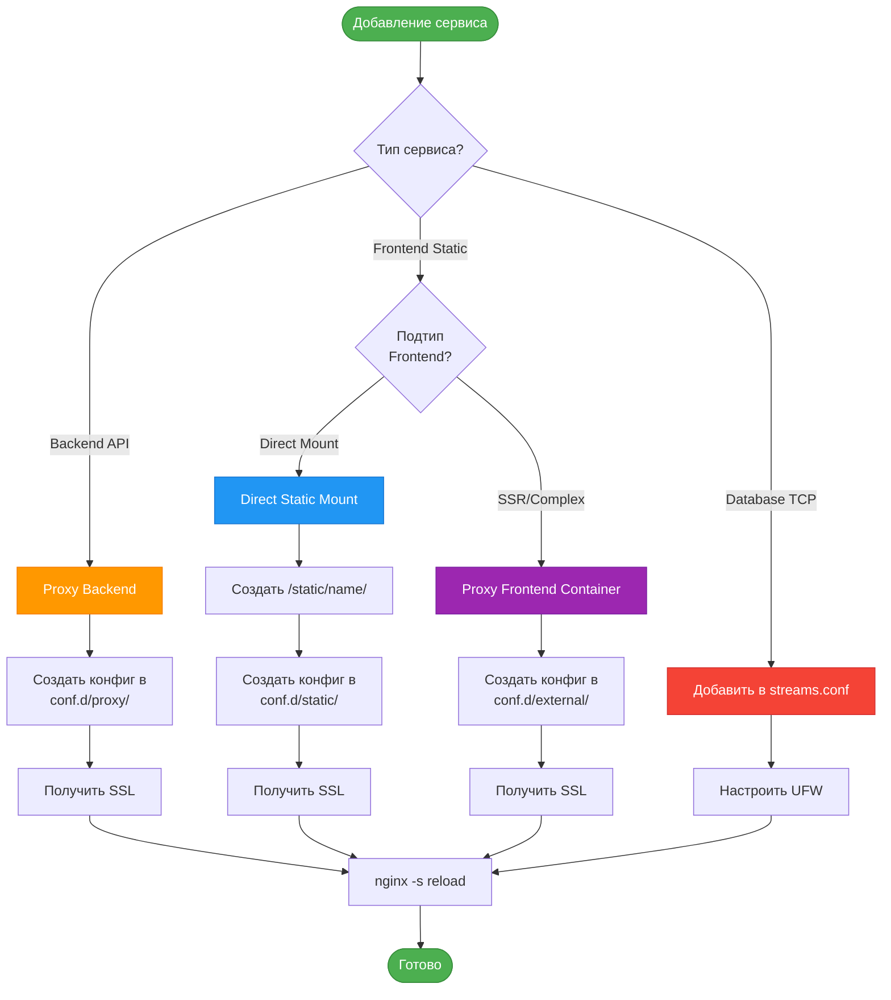
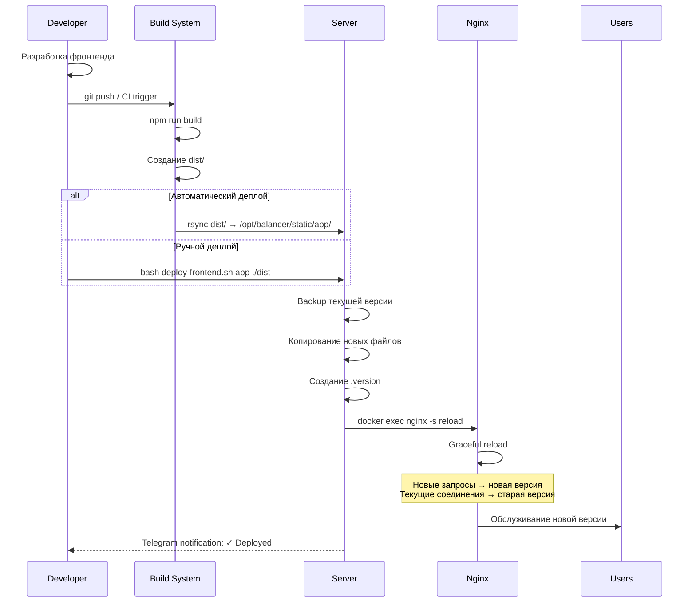

# Дополнение к ПРД: Архитектура прямого подключения фронтендов

## Версия: 2.1 - Frontend Direct Mount Extension
**Дата:** 06.11.2025  
**Статус:** Дополнение к основному ПРД

---

## Содержание дополнения

1. [Обзор архитектуры подключения](#1-обзор-архитектуры-подключения)
2. [Обновленная структура каталогов](#2-обновленная-структура-каталогов)
3. [Типы подключения сервисов](#3-типы-подключения-сервисов)
4. [Конфигурации для direct mount](#4-конфигурации-для-direct-mount)
5. [Обновленный скрипт добавления](#5-обновленный-скрипт-добавления)
6. [Обновленный Docker Compose](#6-обновленный-docker-compose)
7. [Workflow развертывания](#7-workflow-развертывания)

---

## 1. Обзор архитектуры подключения

### 1.1 Проблема дублирования

**Текущая проблема:**
```
Client -> Nginx-Proxy -> Frontend-Nginx-Container -> Static Files
          (80MB RAM)      (80MB RAM)
```

**Оптимизированное решение:**
```
Client -> Nginx-Proxy -> Static Files (Direct Mount)
          (80MB RAM)
```

### 1.2 Типы подключения сервисов

```mermaid
graph TB
    subgraph "Тип 1: Proxy (Backend Services)"
        C1[Client] --> NP1[Nginx Proxy]
        NP1 --> BC1[Backend Container<br/>FastAPI/API]
        style BC1 fill:#FF9800
    end
    
    subgraph "Тип 2: Direct Static (Frontend)"
        C2[Client] --> NP2[Nginx Proxy]
        NP2 --> VM[Volume Mount<br/>/static/frontend1]
        style VM fill:#4CAF50
    end
    
    subgraph "Тип 3: Proxy Frontend Container"
        C3[Client] --> NP3[Nginx Proxy]
        NP3 --> FC[Frontend Container<br/>Nginx]
        FC --> FS[Static Files]
        style FC fill:#2196F3
    end
    
    subgraph "Тип 4: TCP Stream (Database)"
        C4[Client] --> NP4[Nginx Proxy<br/>TCP Stream]
        NP4 --> DB[(Database<br/>PostgreSQL/CouchDB)]
        style DB fill:#9C27B0
    end
    
    style NP1 fill:#F44336,color:#fff
    style NP2 fill:#F44336,color:#fff
    style NP3 fill:#F44336,color:#fff
    style NP4 fill:#F44336,color:#fff
```



### 1.3 Сравнение подходов

| Критерий | Proxy Container | Direct Static Mount |
|----------|----------------|---------------------|
| **Производительность** | Среднее (2 прокси) | Высокое (1 прокси) |
| **Потребление RAM** | ~160MB | ~80MB |
| **Сложность деплоя** | Средняя | Низкая |
| **Обновление контента** | Restart container | Copy files |
| **Изоляция** | Высокая | Средняя |
| **Hot reload** | Нет | Да (nginx reload) |
| **Рекомендация** | Для SSR, сложных SPA | Для статики, билдов |

---

## 2. Обновленная структура каталогов

```
/opt/balancer/
├── docker-compose.yml
├── .env
├── README.md
│
├── nginx/
│   ├── nginx.conf
│   ├── conf.d/
│   │   ├── default.conf
│   │   ├── streams.conf
│   │   ├── proxy/                    # NEW: Proxy конфиги
│   │   │   ├── api-service.conf
│   │   │   └── backend-service.conf
│   │   ├── static/                   # NEW: Static конфиги
│   │   │   ├── frontend1.conf
│   │   │   └── frontend2.conf
│   │   └── external/                 # NEW: External proxy конфиги
│   │       └── admin-frontend.conf
│   ├── snippets/
│   │   ├── ssl-params.conf
│   │   ├── security-headers.conf
│   │   ├── proxy-params.conf
│   │   └── static-params.conf       # NEW: Параметры для статики
│   └── html/
│       ├── 50x.html
│       └── index.html
│
├── static/                           # NEW: Статический контент
│   ├── frontend1/                    # Прямое подключение
│   │   ├── index.html
│   │   ├── assets/
│   │   └── .version                  # Версия деплоя
│   ├── frontend2/
│   │   ├── index.html
│   │   └── assets/
│   └── shared/                       # Общие ресурсы
│       ├── images/
│       └── fonts/
│
├── certbot/
│   └── conf/
│
├── logs/
│   ├── nginx/
│   │   ├── proxy/                    # NEW: Логи proxy сервисов
│   │   ├── static/                   # NEW: Логи static сервисов
│   │   └── external/                 # NEW: Логи external сервисов
│   └── certbot/
│
├── scripts/
│   ├── init-balancer.sh
│   ├── add-service.sh               # UPDATED: Расширенный функционал
│   ├── remove-service.sh
│   ├── deploy-frontend.sh           # NEW: Деплой статики
│   ├── health-check.sh
│   └── telegram-alert.sh
│
├── templates/
│   ├── service-fastapi.conf.tmpl
│   ├── service-frontend-proxy.conf.tmpl
│   ├── service-frontend-static.conf.tmpl  # NEW: Прямая статика
│   ├── service-http.conf.tmpl
│   └── service-tcp.conf.tmpl
│
├── deployments/                      # NEW: История деплоев
│   ├── frontend1/
│   │   ├── 2025-11-06_10-30-15/
│   │   └── current -> 2025-11-06_10-30-15
│   └── frontend2/
│
└── healthcheck/
    ├── Dockerfile
    └── entrypoint.sh
```

---

## 3. Типы подключения сервисов

### 3.1 Классификация



### 3.2 Когда использовать каждый тип

| Тип | Использовать когда | Примеры |
|-----|-------------------|---------|
| **Proxy Backend** | API, динамический контент | FastAPI, Django REST, Node.js API |
| **Direct Static** | Статический билд, SPA | React build, Vue build, Angular dist |
| **Proxy Frontend Container** | SSR, сложная логика, кастомный nginx | Next.js, Nuxt.js, custom nginx configs |
| **TCP Stream** | Базы данных | PostgreSQL, MySQL, MongoDB, CouchDB |

---

## 4. Конфигурации для direct mount

### 4.1 Snippet для статики

```nginx
# /opt/balancer/nginx/snippets/static-params.conf

# Оптимизация для статического контента
sendfile on;
sendfile_max_chunk 1m;
tcp_nopush on;

# Кеширование на стороне клиента
expires 1y;
add_header Cache-Control "public, immutable";

# Проверка свежести контента
if_modified_since before;

# Отключение логирования для статики
access_log off;

# Компрессия
gzip_static on;

# Open file cache
open_file_cache max=1000 inactive=20s;
open_file_cache_valid 30s;
open_file_cache_min_uses 2;
open_file_cache_errors off;
```

### 4.2 Шаблон для Direct Static Frontend

```nginx
# /opt/balancer/templates/service-frontend-static.conf.tmpl

# Upstream не нужен - обслуживается напрямую
map $sent_http_content_type $expires {
    default                    off;
    text/html                  epoch;
    text/css                   max;
    application/javascript     max;
    application/json           epoch;
    ~image/                    max;
    ~font/                     max;
}

# HTTP -> HTTPS редирект
server {
    listen 80;
    listen [::]:80;
    server_name {DOMAIN};

    # Let's Encrypt ACME challenge
    location /.well-known/acme-challenge/ {
        root /var/www/certbot;
        allow all;
    }

    location / {
        return 301 https://$server_name$request_uri;
    }
}

# HTTPS сервер для статики
server {
    listen 443 ssl http2;
    listen [::]:443 ssl http2;
    server_name {DOMAIN};

    # SSL сертификаты
    ssl_certificate /etc/letsencrypt/live/{DOMAIN}/fullchain.pem;
    ssl_certificate_key /etc/letsencrypt/live/{DOMAIN}/privkey.pem;
    ssl_trusted_certificate /etc/letsencrypt/live/{DOMAIN}/chain.pem;

    # Подключение общих параметров
    include /etc/nginx/snippets/ssl-params.conf;
    include /etc/nginx/snippets/security-headers.conf;

    # Логи
    access_log /var/log/nginx/static-{SERVICE_NAME}-access.log detailed;
    error_log /var/log/nginx/static-{SERVICE_NAME}-error.log warn;

    # Rate limiting
    limit_req zone=general burst=50 nodelay;

    # Корневая директория статики
    root /usr/share/nginx/static/{SERVICE_NAME};
    index index.html;

    # Charset
    charset utf-8;

    # Основная локация для SPA
    location / {
        # Попробовать файл, затем директорию, затем fallback на index.html
        try_files $uri $uri/ /index.html;
        
        # Кеширование HTML
        add_header Cache-Control "no-cache, no-store, must-revalidate";
        expires -1;
    }

    # Статические ассеты с агрессивным кешированием
    location ~* \.(js|css|png|jpg|jpeg|gif|ico|svg|woff|woff2|ttf|eot|otf)$ {
        include /etc/nginx/snippets/static-params.conf;
        expires 1y;
        add_header Cache-Control "public, immutable";
        access_log off;
    }

    # JSON файлы (могут обновляться)
    location ~* \.json$ {
        add_header Cache-Control "no-cache";
        expires -1;
    }

    # Manifest и service worker
    location ~* \.(manifest|webmanifest)$ {
        add_header Cache-Control "public, max-age=3600";
        expires 1h;
    }

    location = /service-worker.js {
        add_header Cache-Control "no-cache, no-store, must-revalidate";
        expires -1;
    }

    # Отключить доступ к dot-файлам
    location ~ /\. {
        deny all;
        access_log off;
        log_not_found off;
    }

    # Отключить доступ к исходникам (опционально)
    location ~* \.(map|ts|tsx|jsx)$ {
        deny all;
        access_log off;
        log_not_found off;
    }

    # Gzip для текстовых файлов
    gzip on;
    gzip_vary on;
    gzip_min_length 1024;
    gzip_proxied any;
    gzip_comp_level 6;
    gzip_types
        text/plain
        text/css
        text/xml
        text/javascript
        application/json
        application/javascript
        application/xml+rss
        application/rss+xml
        image/svg+xml;

    # Версия приложения (для мониторинга)
    location /.version {
        default_type text/plain;
        expires -1;
        add_header Cache-Control "no-cache";
    }

    # Health check
    location /health {
        access_log off;
        return 200 "OK\n";
        add_header Content-Type text/plain;
    }
}
```

### 4.3 Сравнительный шаблон Proxy Frontend

```nginx
# /opt/balancer/templates/service-frontend-proxy.conf.tmpl
# Для случаев когда frontend в отдельном контейнере

# Upstream для frontend контейнера
upstream {SERVICE_NAME}_frontend {
    server {BACKEND_HOST}:{BACKEND_PORT} max_fails=3 fail_timeout=30s;
    keepalive 32;
}

# HTTP -> HTTPS редирект
server {
    listen 80;
    listen [::]:80;
    server_name {DOMAIN};

    location /.well-known/acme-challenge/ {
        root /var/www/certbot;
        allow all;
    }

    location / {
        return 301 https://$server_name$request_uri;
    }
}

# HTTPS сервер для проксирования
server {
    listen 443 ssl http2;
    listen [::]:443 ssl http2;
    server_name {DOMAIN};

    ssl_certificate /etc/letsencrypt/live/{DOMAIN}/fullchain.pem;
    ssl_certificate_key /etc/letsencrypt/live/{DOMAIN}/privkey.pem;
    ssl_trusted_certificate /etc/letsencrypt/live/{DOMAIN}/chain.pem;

    include /etc/nginx/snippets/ssl-params.conf;
    include /etc/nginx/snippets/security-headers.conf;

    access_log /var/log/nginx/external-{SERVICE_NAME}-access.log detailed;
    error_log /var/log/nginx/external-{SERVICE_NAME}-error.log warn;

    limit_req zone=general burst=50 nodelay;

    location / {
        include /etc/nginx/snippets/proxy-params.conf;
        proxy_pass http://{SERVICE_NAME}_frontend;
    }

    # Кеширование статики от upstream
    location ~* \.(jpg|jpeg|png|gif|ico|css|js|svg|woff|woff2|ttf|eot|otf)$ {
        proxy_cache STATIC;
        proxy_cache_valid 200 7d;
        proxy_cache_use_stale error timeout updating http_500 http_502 http_503 http_504;
        
        add_header X-Cache-Status $upstream_cache_status;
        expires 7d;
        
        include /etc/nginx/snippets/proxy-params.conf;
        proxy_pass http://{SERVICE_NAME}_frontend;
    }
}
```

---

## 5. Обновленный скрипт добавления

```bash
#!/bin/bash
# /opt/balancer/scripts/add-service.sh
# UPDATED VERSION 2.1 - С поддержкой разных типов подключения

set -e

RED='\033[0;31m'
GREEN='\033[0;32m'
YELLOW='\033[1;33m'
BLUE='\033[0;34m'
CYAN='\033[0;36m'
NC='\033[0m'

SCRIPT_DIR="$(cd "$(dirname "${BASH_SOURCE[0]}")" && pwd)"
PROJECT_DIR="$(dirname "$SCRIPT_DIR")"
NGINX_CONF_DIR="$PROJECT_DIR/nginx/conf.d"
TEMPLATES_DIR="$PROJECT_DIR/templates"
STATIC_DIR="$PROJECT_DIR/static"

echo -e "${BLUE}╔════════════════════════════════════════╗${NC}"
echo -e "${BLUE}║     Добавление нового сервиса          ║${NC}"
echo -e "${BLUE}║     Version 2.1 - Extended             ║${NC}"
echo -e "${BLUE}╚════════════════════════════════════════╝${NC}\n"

# Загрузка переменных окружения
if [ -f "$PROJECT_DIR/.env" ]; then
    source "$PROJECT_DIR/.env"
else
    echo -e "${RED}Ошибка: .env файл не найден${NC}"
    exit 1
fi

# Функции валидации (как в предыдущей версии)
validate_domain() {
    local domain=$1
    if [[ ! $domain =~ ^[a-zA-Z0-9]([a-zA-Z0-9-]{0,61}[a-zA-Z0-9])?(\.[a-zA-Z0-9]([a-zA-Z0-9-]{0,61}[a-zA-Z0-9])?)*$ ]]; then
        echo -e "${RED}Ошибка: Некорректный формат домена${NC}"
        return 1
    fi
    return 0
}

check_dns() {
    local domain=$1
    echo -e "${YELLOW}Проверка DNS записи для $domain...${NC}"
    
    if host $domain > /dev/null 2>&1; then
        local ip=$(host $domain | awk '/has address/ { print $4 }' | head -1)
        local server_ip=$(curl -s ifconfig.me || curl -s icanhazip.com)
        
        echo "DNS указывает на: $ip"
        echo "IP сервера: $server_ip"
        
        if [ "$ip" == "$server_ip" ]; then
            echo -e "${GREEN}✓ DNS запись корректна${NC}"
            return 0
        else
            echo -e "${YELLOW}⚠ DNS и IP сервера не совпадают${NC}"
            read -p "Продолжить? (y/n): " confirm
            [ "$confirm" != "y" ] && return 1
        fi
    else
        echo -e "${YELLOW}⚠ DNS запись не найдена${NC}"
        read -p "Продолжить без DNS? (y/n): " confirm
        [ "$confirm" != "y" ] && return 1
    fi
    return 0
}

# === НОВАЯ ФУНКЦИЯ: Выбор типа сервиса ===
select_service_category() {
    echo -e "\n${CYAN}╔════════════════════════════════════════╗${NC}"
    echo -e "${CYAN}║     Категория сервиса                  ║${NC}"
    echo -e "${CYAN}╚════════════════════════════════════════╝${NC}\n"
    
    echo -e "${YELLOW}Выберите категорию сервиса:${NC}"
    echo ""
    echo "  ${GREEN}1) Backend API${NC}"
    echo "     └─ FastAPI, Django, Node.js, другие API"
    echo ""
    echo "  ${GREEN}2) Frontend (Static)${NC}"
    echo "     └─ React, Vue, Angular билды (рекомендуется)"
    echo ""
    echo "  ${GREEN}3) Frontend (Container)${NC}"
    echo "     └─ SSR приложения, кастомный Nginx"
    echo ""
    echo "  ${GREEN}4) Database (TCP Stream)${NC}"
    echo "     └─ PostgreSQL, MySQL, CouchDB"
    echo ""
    
    read -p "Ваш выбор (1-4): " CATEGORY
    
    case $CATEGORY in
        1) CATEGORY_TYPE="backend";;
        2) CATEGORY_TYPE="frontend-static";;
        3) CATEGORY_TYPE="frontend-proxy";;
        4) CATEGORY_TYPE="database";;
        *) echo -e "${RED}Некорректный выбор${NC}"; return 1;;
    esac
    
    echo -e "${GREEN}✓ Выбрана категория: $CATEGORY_TYPE${NC}"
    return 0
}

# === НОВАЯ ФУНКЦИЯ: Конфигурация Backend ===
configure_backend_service() {
    echo -e "\n${CYAN}═══ Backend API конфигурация ═══${NC}\n"
    
    echo -e "${YELLOW}Тип Backend API:${NC}"
    echo "1. FastAPI"
    echo "2. Django / Flask"
    echo "3. Node.js / Express"
    echo "4. Other HTTP API"
    read -p "Выбор (1-4): " backend_type
    
    case $backend_type in
        1) SERVICE_TEMPLATE="service-fastapi.conf.tmpl";;
        2|3|4) SERVICE_TEMPLATE="service-http.conf.tmpl";;
        *) SERVICE_TEMPLATE="service-http.conf.tmpl";;
    esac
    
    read -p "Имя Docker контейнера бэкенда: " BACKEND_HOST
    read -p "Порт бэкенда: " BACKEND_PORT
    
    read -p "Включить IP-фильтрацию? (y/n): " IP_FILTER
    if [ "$IP_FILTER" == "y" ]; then
        read -p "Разрешенная подсеть (например: 192.168.1.0/24): " ALLOWED_SUBNET
    fi
    
    CONFIG_SUBDIR="proxy"
}

# === НОВАЯ ФУНКЦИЯ: Конфигурация Frontend Static ===
configure_frontend_static() {
    echo -e "\n${CYAN}═══ Frontend Static конфигурация ═══${NC}\n"
    
    echo -e "${GREEN}Этот режим монтирует статические файлы напрямую в Nginx${NC}"
    echo -e "${GREEN}Нет дополнительного контейнера = меньше ресурсов${NC}\n"
    
    SERVICE_TEMPLATE="service-frontend-static.conf.tmpl"
    CONFIG_SUBDIR="static"
    
    # Создание директории для статики
    STATIC_SERVICE_DIR="$STATIC_DIR/$SERVICE_NAME"
    mkdir -p "$STATIC_SERVICE_DIR"
    
    echo -e "${YELLOW}Директория для статики создана:${NC} $STATIC_SERVICE_DIR"
    echo -e "${YELLOW}После настройки скопируйте ваш билд в:${NC}"
    echo -e "  ${CYAN}$STATIC_SERVICE_DIR/${NC}\n"
    
    # Создание placeholder файлов
    cat > "$STATIC_SERVICE_DIR/index.html" << 'EOF'
<!DOCTYPE html>
<html>
<head>
    <meta charset="UTF-8">
    <meta name="viewport" content="width=device-width, initial-scale=1.0">
    <title>Service Placeholder</title>
    <style>
        body {
            font-family: Arial, sans-serif;
            display: flex;
            justify-content: center;
            align-items: center;
            height: 100vh;
            margin: 0;
            background: linear-gradient(135deg, #667eea 0%, #764ba2 100%);
            color: white;
        }
        .container {
            text-align: center;
            padding: 2rem;
            background: rgba(0,0,0,0.2);
            border-radius: 10px;
        }
        h1 { margin-bottom: 1rem; }
        .status { color: #4ade80; font-size: 1.2rem; }
    </style>
</head>
<body>
    <div class="container">
        <h1>🚀 Service Ready</h1>
        <p class="status">Placeholder page - deploy your application</p>
        <p>Service: <strong id="serviceName"></strong></p>
        <p><small>Replace this index.html with your build</small></p>
    </div>
    <script>
        document.getElementById('serviceName').textContent = window.location.hostname;
    </script>
</body>
</html>
EOF
    
    echo "1.0.0-placeholder" > "$STATIC_SERVICE_DIR/.version"
    
    echo -e "${GREEN}✓ Placeholder файлы созданы${NC}"
    
    BACKEND_HOST=""
    BACKEND_PORT=""
}

# === НОВАЯ ФУНКЦИЯ: Конфигурация Frontend Proxy ===
configure_frontend_proxy() {
    echo -e "\n${CYAN}═══ Frontend Container конфигурация ═══${NC}\n"
    
    echo -e "${YELLOW}Используйте этот режим для:${NC}"
    echo "  - SSR приложений (Next.js, Nuxt.js)"
    echo "  - Сложных конфигураций Nginx"
    echo "  - Когда нужна изоляция в контейнере"
    echo ""
    
    SERVICE_TEMPLATE="service-frontend-proxy.conf.tmpl"
    CONFIG_SUBDIR="external"
    
    read -p "Имя Docker контейнера frontend: " BACKEND_HOST
    read -p "Порт frontend контейнера: " BACKEND_PORT
}

# === НОВАЯ ФУНКЦИЯ: Конфигурация Database ===
configure_database() {
    echo -e "\n${CYAN}═══ Database TCP Stream конфигурация ═══${NC}\n"
    
    echo -e "${YELLOW}Тип базы данных:${NC}"
    echo "1. PostgreSQL (5432)"
    echo "2. MySQL/MariaDB (3306)"
    echo "3. CouchDB (5984)"
    echo "4. MongoDB (27017)"
    echo "5. Other"
    read -p "Выбор (1-5): " db_type
    
    case $db_type in
        1) DEFAULT_PORT=5432; DB_NAME="PostgreSQL";;
        2) DEFAULT_PORT=3306; DB_NAME="MySQL";;
        3) DEFAULT_PORT=5984; DB_NAME="CouchDB";;
        4) DEFAULT_PORT=27017; DB_NAME="MongoDB";;
        5) DEFAULT_PORT=""; DB_NAME="Custom";;
    esac
    
    read -p "Имя Docker контейнера БД: " BACKEND_HOST
    
    if [ -n "$DEFAULT_PORT" ]; then
        read -p "Порт БД [$DEFAULT_PORT]: " BACKEND_PORT
        BACKEND_PORT=${BACKEND_PORT:-$DEFAULT_PORT}
    else
        read -p "Порт БД: " BACKEND_PORT
    fi
    
    read -p "Внешний TCP порт [$BACKEND_PORT]: " EXTERNAL_PORT
    EXTERNAL_PORT=${EXTERNAL_PORT:-$BACKEND_PORT}
    
    echo -e "\n${YELLOW}⚠ ВАЖНО: Безопасность${NC}"
    echo "Рекомендуется ограничить доступ по IP"
    read -p "Настроить IP-фильтрацию через UFW? (y/n): " SETUP_UFW
    
    if [ "$SETUP_UFW" == "y" ]; then
        read -p "Разрешенная подсеть (например: 192.168.1.0/24): " ALLOWED_SUBNET
    fi
    
    CONFIG_SUBDIR=""
}

# === ОСНОВНОЙ ПРОЦЕСС ===

# Сбор базовой информации
echo -e "${BLUE}═══ Базовые параметры ═══${NC}\n"

read -p "Имя сервиса (латиница, без пробелов): " SERVICE_NAME
SERVICE_NAME=$(echo "$SERVICE_NAME" | tr '[:upper:]' '[:lower:]' | tr -cd '[:alnum:]_-')

read -p "Поддомен (например: api): " SUBDOMAIN
read -p "Основной домен (например: example.ru): " MAIN_DOMAIN
DOMAIN="${SUBDOMAIN}.${MAIN_DOMAIN}"

validate_domain "$DOMAIN" || exit 1

# Выбор категории
select_service_category || exit 1

# Конфигурация в зависимости от категории
case $CATEGORY_TYPE in
    "backend")
        configure_backend_service
        ;;
    "frontend-static")
        configure_frontend_static
        ;;
    "frontend-proxy")
        configure_frontend_proxy
        ;;
    "database")
        configure_database
        ;;
esac

# Проверка DNS (кроме database)
if [ "$CATEGORY_TYPE" != "database" ]; then
    check_dns "$DOMAIN" || exit 1
fi

# === ПОДТВЕРЖДЕНИЕ ===
echo -e "\n${BLUE}╔════════════════════════════════════════╗${NC}"
echo -e "${BLUE}║     Подтверждение конфигурации         ║${NC}"
echo -e "${BLUE}╚════════════════════════════════════════╝${NC}\n"

echo "Имя сервиса: ${GREEN}$SERVICE_NAME${NC}"
echo "Категория: ${GREEN}$CATEGORY_TYPE${NC}"
echo "Домен: ${GREEN}$DOMAIN${NC}"

if [ "$CATEGORY_TYPE" != "frontend-static" ] && [ "$CATEGORY_TYPE" != "database" ]; then
    echo "Бэкенд: ${GREEN}$BACKEND_HOST:$BACKEND_PORT${NC}"
fi

if [ "$CATEGORY_TYPE" == "frontend-static" ]; then
    echo "Статика: ${GREEN}$STATIC_SERVICE_DIR${NC}"
fi

if [ "$CATEGORY_TYPE" == "database" ]; then
    echo "Бэкенд: ${GREEN}$BACKEND_HOST:$BACKEND_PORT${NC}"
    echo "Внешний порт: ${GREEN}$EXTERNAL_PORT${NC}"
fi

if [ -n "$CONFIG_SUBDIR" ]; then
    echo "Конфиг: ${GREEN}conf.d/$CONFIG_SUBDIR/$SERVICE_NAME.conf${NC}"
else
    echo "Конфиг: ${GREEN}conf.d/streams.conf${NC}"
fi

echo ""
read -p "Подтвердите создание (yes/no): " CONFIRM
[ "$CONFIRM" != "yes" ] && { echo -e "${RED}Отменено${NC}"; exit 0; }

# === СОЗДАНИЕ КОНФИГУРАЦИИ ===
echo -e "\n${YELLOW}Создание конфигурации...${NC}"

if [ "$CATEGORY_TYPE" != "database" ]; then
    # HTTP/HTTPS конфигурация
    
    # Создание поддиректории если нужно
    if [ -n "$CONFIG_SUBDIR" ]; then
        mkdir -p "$NGINX_CONF_DIR/$CONFIG_SUBDIR"
        CONFIG_FILE="$NGINX_CONF_DIR/$CONFIG_SUBDIR/${SERVICE_NAME}.conf"
        
        # Создать поддиректорию для логов
        mkdir -p "$PROJECT_DIR/logs/nginx/$CONFIG_SUBDIR"
    else
        CONFIG_FILE="$NGINX_CONF_DIR/${SERVICE_NAME}.conf"
    fi
    
    # Генерация конфига
    sed -e "s/{SERVICE_NAME}/$SERVICE_NAME/g" \
        -e "s/{DOMAIN}/$DOMAIN/g" \
        -e "s/{BACKEND_HOST}/$BACKEND_HOST/g" \
        -e "s/{BACKEND_PORT}/$BACKEND_PORT/g" \
        "$TEMPLATES_DIR/$SERVICE_TEMPLATE" > "$CONFIG_FILE"
    
    # IP-фильтрация для backend
    if [ "$IP_FILTER" == "y" ] && [ -n "$ALLOWED_SUBNET" ]; then
        sed -i "/# IP фильтрация/a\    allow $ALLOWED_SUBNET;\n    deny all;" "$CONFIG_FILE"
    fi
    
    echo -e "${GREEN}✓ Конфиг создан: $CONFIG_FILE${NC}"
    
    # Получение SSL сертификата
    echo -e "\n${YELLOW}Получение SSL сертификата...${NC}"
    
    docker compose -f "$PROJECT_DIR/docker-compose.yml" run --rm certbot \
        certonly --webroot -w /var/www/certbot \
        --email "$LETSENCRYPT_EMAIL" \
        --agree-tos \
        --no-eff-email \
        -d "$DOMAIN" \
        --non-interactive || {
            echo -e "${RED}✗ Ошибка получения SSL${NC}"
            rm "$CONFIG_FILE"
            exit 1
        }
    
    echo -e "${GREEN}✓ SSL сертификат получен${NC}"
    
else
    # TCP Stream конфигурация
    STREAM_CONF="$NGINX_CONF_DIR/streams.conf"
    
    cat >> "$STREAM_CONF" << EOF

# $SERVICE_NAME - $DB_NAME
upstream ${SERVICE_NAME}_backend {
    server ${BACKEND_HOST}:${BACKEND_PORT} max_fails=3 fail_timeout=30s;
}

server {
    listen ${EXTERNAL_PORT};
    listen [::]:${EXTERNAL_PORT};
    proxy_pass ${SERVICE_NAME}_backend;
    proxy_connect_timeout 10s;
    proxy_timeout 30m;
}
EOF
    
    echo -e "${GREEN}✓ TCP stream добавлен${NC}"
    
    # Настройка UFW для TCP
    if [ "$SETUP_UFW" == "y" ]; then
        echo -e "${YELLOW}Настройка UFW...${NC}"
        
        # Удалить общее правило если есть
        ufw delete allow "$EXTERNAL_PORT/tcp" 2>/dev/null || true
        
        # Добавить ограниченное правило
        ufw allow from "$ALLOWED_SUBNET" to any port "$EXTERNAL_PORT" proto tcp comment "$SERVICE_NAME"
        ufw reload
        
        echo -e "${GREEN}✓ UFW правило добавлено${NC}"
    else
        echo -e "${YELLOW}⚠ Не забудьте открыть порт $EXTERNAL_PORT в UFW и docker-compose.yml${NC}"
    fi
fi

# === ПРОВЕРКА И ПЕРЕЗАГРУЗКА ===
echo -e "\n${YELLOW}Проверка конфигурации Nginx...${NC}"
docker exec nginx-proxy nginx -t || {
    echo -e "${RED}✗ Ошибка в конфигурации${NC}"
    [ -f "$CONFIG_FILE" ] && rm "$CONFIG_FILE"
    exit 1
}
echo -e "${GREEN}✓ Конфигурация валидна${NC}"

echo -e "\n${YELLOW}Перезагрузка Nginx...${NC}"
docker exec nginx-proxy nginx -s reload || {
    echo -e "${RED}✗ Ошибка перезагрузки${NC}"
    exit 1
}
echo -e "${GREEN}✓ Nginx перезагружен${NC}"

# === УВЕДОМЛЕНИЕ ===
MESSAGE="✅ Новый сервис добавлен\n\n"
MESSAGE+="Сервис: $SERVICE_NAME\n"
MESSAGE+="Категория: $CATEGORY_TYPE\n"
MESSAGE+="Домен: $DOMAIN"

bash "$SCRIPT_DIR/telegram-alert.sh" "$MESSAGE" 2>/dev/null || true

# === ИТОГОВАЯ ИНФОРМАЦИЯ ===
echo -e "\n${GREEN}╔════════════════════════════════════════╗${NC}"
echo -e "${GREEN}║     Сервис успешно добавлен!          ║${NC}"
echo -e "${GREEN}╚════════════════════════════════════════╝${NC}\n"

if [ "$CATEGORY_TYPE" == "frontend-static" ]; then
    echo -e "${CYAN}Следующие шаги для деплоя статики:${NC}\n"
    echo -e "1. Скопируйте ваш билд:"
    echo -e "   ${YELLOW}rsync -av dist/ user@server:$STATIC_SERVICE_DIR/${NC}"
    echo -e ""
    echo -e "2. Или используйте скрипт деплоя:"
    echo -e "   ${YELLOW}bash scripts/deploy-frontend.sh $SERVICE_NAME${NC}"
    echo -e ""
    echo -e "3. Проверьте доступность:"
    echo -e "   ${YELLOW}curl -I https://$DOMAIN${NC}\n"
    
elif [ "$CATEGORY_TYPE" != "database" ]; then
    echo -e "Доступен по адресу: ${GREEN}https://$DOMAIN${NC}"
    echo -e "Проверка: ${YELLOW}curl -I https://$DOMAIN${NC}\n"
else
    echo -e "Доступен по порту: ${GREEN}$EXTERNAL_PORT${NC}"
    echo -e "Проверка: ${YELLOW}telnet $MAIN_DOMAIN $EXTERNAL_PORT${NC}\n"
fi

if [ -n "$CONFIG_SUBDIR" ]; then
    echo -e "Конфиг: ${YELLOW}$NGINX_CONF_DIR/$CONFIG_SUBDIR/$SERVICE_NAME.conf${NC}"
    echo -e "Логи: ${YELLOW}tail -f $PROJECT_DIR/logs/nginx/$CONFIG_SUBDIR/${SERVICE_NAME}-*.log${NC}\n"
else
    echo -e "Логи: ${YELLOW}tail -f $PROJECT_DIR/logs/nginx/stream-*.log${NC}\n"
fi

echo -e "${BLUE}═══════════════════════════════════════${NC}"
```

---

## 6. Обновленный Docker Compose

```yaml
# /opt/balancer/docker-compose.yml
# UPDATED VERSION 2.1 - с поддержкой static mount

version: '3.8'

networks:
  proxy_network:
    name: proxy_network
    driver: bridge
    ipam:
      config:
        - subnet: 172.20.0.0/16
  
  internal_network:
    name: internal_network
    driver: bridge
    internal: true
    ipam:
      config:
        - subnet: 172.22.0.0/16

volumes:
  certbot_conf:
    name: certbot_conf
    driver: local
  certbot_www:
    name: certbot_www
    driver: local
  nginx_cache:
    name: nginx_cache
    driver: local

services:
  nginx:
    image: nginx:1.25-alpine
    container_name: nginx-proxy
    restart: unless-stopped
    ports:
      - "80:80"
      - "443:443"
      # Database ports (добавляйте по необходимости)
      - "5432:5432"   # PostgreSQL
      - "5984:5984"   # CouchDB
      # - "3306:3306" # MySQL
      # - "27017:27017" # MongoDB
    volumes:
      # Конфигурации
      - ./nginx/nginx.conf:/etc/nginx/nginx.conf:ro
      - ./nginx/conf.d:/etc/nginx/conf.d:ro
      - ./nginx/snippets:/etc/nginx/snippets:ro
      - ./nginx/html:/usr/share/nginx/html:ro
      
      # SSL сертификаты
      - certbot_conf:/etc/letsencrypt:ro
      - certbot_www:/var/www/certbot:ro
      
      # Статический контент (NEW)
      - ./static:/usr/share/nginx/static:ro
      
      # Кеш и логи
      - nginx_cache:/var/cache/nginx
      - ./logs/nginx:/var/log/nginx
    networks:
      - proxy_network
      - internal_network
    healthcheck:
      test: ["CMD", "nginx", "-t"]
      interval: 30s
      timeout: 3s
      retries: 3
      start_period: 5s
    labels:
      - "com.balancer.description=Nginx Reverse Proxy"
      - "com.balancer.version=2.1"

  certbot:
    image: certbot/certbot:latest
    container_name: certbot
    restart: unless-stopped
    volumes:
      - certbot_conf:/etc/letsencrypt
      - certbot_www:/var/www/certbot
      - ./logs/certbot:/var/log/letsencrypt
    entrypoint: "/bin/sh -c 'trap exit TERM; while :; do certbot renew --webroot -w /var/www/certbot --quiet --deploy-hook \"nginx -s reload\"; sleep 12h & wait $${!}; done;'"
    depends_on:
      nginx:
        condition: service_healthy
    networks:
      - proxy_network
    labels:
      - "com.balancer.description=SSL Certificate Manager"

  healthcheck:
    build: 
      context: ./healthcheck
      dockerfile: Dockerfile
    container_name: healthcheck-monitor
    restart: unless-stopped
    volumes:
      - ./scripts:/scripts:ro
      - certbot_conf:/etc/letsencrypt:ro
      - /var/run/docker.sock:/var/run/docker.sock:ro
      - ./logs:/logs
    environment:
      - TELEGRAM_BOT_TOKEN=${TELEGRAM_BOT_TOKEN}
      - TELEGRAM_CHAT_ID=${TELEGRAM_CHAT_ID}
      - CHECK_INTERVAL=300
      - TZ=${TZ:-Europe/Moscow}
    networks:
      - proxy_network
    depends_on:
      nginx:
        condition: service_healthy
    labels:
      - "com.balancer.description=Health Monitor"
```

---

## 7. Workflow развертывания

### 7.1 Деплой Frontend Static

```bash
#!/bin/bash
# /opt/balancer/scripts/deploy-frontend.sh
# Скрипт для деплоя статического фронтенда

set -e

SERVICE_NAME=$1
BUILD_PATH=$2

if [ -z "$SERVICE_NAME" ] || [ -z "$BUILD_PATH" ]; then
    echo "Usage: $0 <service-name> <build-path>"
    echo "Example: $0 myapp ./dist"
    exit 1
fi

PROJECT_DIR="/opt/balancer"
STATIC_DIR="$PROJECT_DIR/static/$SERVICE_NAME"
DEPLOY_DIR="$PROJECT_DIR/deployments/$SERVICE_NAME"
TIMESTAMP=$(date +%Y-%m-%d_%H-%M-%S)
BACKUP_DIR="$DEPLOY_DIR/$TIMESTAMP"

echo "=== Frontend Deployment ==="
echo "Service: $SERVICE_NAME"
echo "Source: $BUILD_PATH"
echo "Target: $STATIC_DIR"

# Создание backup текущей версии
if [ -d "$STATIC_DIR" ]; then
    echo "Creating backup..."
    mkdir -p "$BACKUP_DIR"
    cp -r "$STATIC_DIR"/* "$BACKUP_DIR/"
    echo "✓ Backup created: $BACKUP_DIR"
fi

# Деплой новой версии
echo "Deploying new version..."
rsync -av --delete "$BUILD_PATH/" "$STATIC_DIR/"

# Создание .version файла
VERSION=$(git describe --tags --always 2>/dev/null || echo "$TIMESTAMP")
echo "$VERSION" > "$STATIC_DIR/.version"

echo "✓ Deployed version: $VERSION"

# Создание symlink на текущую версию
ln -sfn "$BACKUP_DIR" "$DEPLOY_DIR/current"

# Проверка Nginx конфигурации
echo "Testing Nginx configuration..."
docker exec nginx-proxy nginx -t

# Reload Nginx
echo "Reloading Nginx..."
docker exec nginx-proxy nginx -s reload

echo ""
echo "=== Deployment Complete ==="
echo "Version: $VERSION"
echo "Timestamp: $TIMESTAMP"
echo "Backup: $BACKUP_DIR"

# Очистка старых бэкапов (старше 7 дней)
find "$DEPLOY_DIR" -maxdepth 1 -type d -mtime +7 ! -name "current" -exec rm -rf {} \; 2>/dev/null || true

# Отправка уведомления
bash "$PROJECT_DIR/scripts/telegram-alert.sh" \
    "🚀 Frontend deployed\n\nService: $SERVICE_NAME\nVersion: $VERSION\nTime: $TIMESTAMP" \
    2>/dev/null || true

echo ""
echo "Test: curl -I https://<your-domain>"
```

### 7.2 Процесс разработки и деплоя



### 7.3 Откат (Rollback)

```bash
#!/bin/bash
# /opt/balancer/scripts/rollback-frontend.sh

SERVICE_NAME=$1
VERSION=$2  # Опционально: номер версии или "previous"

PROJECT_DIR="/opt/balancer"
STATIC_DIR="$PROJECT_DIR/static/$SERVICE_NAME"
DEPLOY_DIR="$PROJECT_DIR/deployments/$SERVICE_NAME"

if [ -z "$SERVICE_NAME" ]; then
    echo "Usage: $0 <service-name> [version]"
    echo "Example: $0 myapp previous"
    echo "Example: $0 myapp 2025-11-06_10-30-15"
    exit 1
fi

# Определение версии для отката
if [ -z "$VERSION" ] || [ "$VERSION" == "previous" ]; then
    # Найти предыдущую версию
    ROLLBACK_VERSION=$(ls -t "$DEPLOY_DIR" | grep -v "current" | sed -n '2p')
else
    ROLLBACK_VERSION=$VERSION
fi

ROLLBACK_DIR="$DEPLOY_DIR/$ROLLBACK_VERSION"

if [ ! -d "$ROLLBACK_DIR" ]; then
    echo "Error: Version $ROLLBACK_VERSION not found"
    echo "Available versions:"
    ls -1 "$DEPLOY_DIR" | grep -v "current"
    exit 1
fi

echo "=== Frontend Rollback ==="
echo "Service: $SERVICE_NAME"
echo "Rolling back to: $ROLLBACK_VERSION"
read -p "Continue? (yes/no): " confirm

[ "$confirm" != "yes" ] && exit 0

# Копирование версии
rsync -av --delete "$ROLLBACK_DIR/" "$STATIC_DIR/"

# Reload Nginx
docker exec nginx-proxy nginx -s reload

echo "✓ Rollback complete"

# Уведомление
bash "$PROJECT_DIR/scripts/telegram-alert.sh" \
    "⏪ Frontend rollback\n\nService: $SERVICE_NAME\nVersion: $ROLLBACK_VERSION" \
    2>/dev/null || true
```

---

## 8. Примеры использования

### 8.1 Добавление React приложения (Static)

```bash
# На сервере
cd /opt/balancer
sudo bash scripts/add-service.sh

# Ввод:
# Имя: myapp
# Поддомен: app
# Домен: example.ru
# Категория: 2 (Frontend Static)
# 
# Результат: https://app.example.ru готов
# Директория: /opt/balancer/static/myapp/

# На локальной машине разработчика
cd my-react-app
npm run build

# Деплой
rsync -av --delete dist/ user@server:/opt/balancer/static/myapp/

# Или через скрипт на сервере
bash /opt/balancer/scripts/deploy-frontend.sh myapp ./dist
```

### 8.2 Добавление FastAPI бэкенда

```bash
sudo bash scripts/add-service.sh

# Ввод:
# Имя: api
# Поддомен: api
# Домен: example.ru
# Категория: 1 (Backend API)
# Тип: 1 (FastAPI)
# Контейнер: fastapi-app
# Порт: 8000
```

### 8.3 Добавление Next.js (SSR)

```bash
sudo bash scripts/add-service.sh

# Ввод:
# Имя: webapp
# Поддомен: www
# Домен: example.ru
# Категория: 3 (Frontend Container)
# Контейнер: nextjs-app
# Порт: 3000
```

### 8.4 Мониторинг статики

```bash
# Проверка версии
curl https://app.example.ru/.version

# Проверка cache headers
curl -I https://app.example.ru/assets/main.js

# Размер директории
du -sh /opt/balancer/static/myapp/

# Список версий
ls -lh /opt/balancer/deployments/myapp/
```

---

## 9. Сравнительная таблица подходов

| Параметр | Static Mount | Proxy Container |
|----------|-------------|-----------------|
| **RAM usage** | ~80MB (1 Nginx) | ~160MB (2 Nginx) |
| **Latency** | ~2-5ms | ~5-10ms |
| **Деплой** | Copy files + reload | Build + restart |
| **Rollback** | Instant | Requires rebuild |
| **Cache control** | Nginx config | Upstream + Nginx |
| **Hot reload** | Yes (nginx -s reload) | Container restart |
| **Isolation** | Low | High |
| **Complexity** | Low | Medium |
| **Best for** | SPA builds, static | SSR, custom logic |

---

## 10. Чек-лист миграции

Для существующих сервисов, которые нужно перевести на direct mount:

```
☐ 1. Backup текущего сервиса
   ☐ Экспорт конфигурации
   ☐ Backup контента

☐ 2. Подготовка
   ☐ Создать директорию в /static/
   ☐ Скопировать контент из контейнера
   ☐ Проверить права доступа

☐ 3. Создание новой конфигурации
   ☐ Запустить add-service.sh
   ☐ Выбрать Frontend Static
   ☐ Указать существующий домен

☐ 4. Переключение
   ☐ Удалить старую конфигурацию
   ☐ Остановить старый контейнер
   ☐ Reload Nginx

☐ 5. Проверка
   ☐ Тест доступности
   ☐ Проверка логов
   ☐ Мониторинг производительности

☐ 6. Очистка
   ☐ Удалить старый контейнер
   ☐ Удалить старые volumes
```

---

## Заключение

Добавление поддержки прямого монтирования статики обеспечивает:

✅ **Снижение потребления ресурсов на 50%**  
✅ **Упрощение деплоя фронтендов**  
✅ **Мгновенные rollback без rebuild**  
✅ **Лучшая производительность**  
✅ **Гибкость архитектуры**

Используйте **Static Mount** для:
- React, Vue, Angular builds
- Простых статических сайтов
- Landing pages
- Documentation sites

Используйте **Proxy Container** для:
- Next.js, Nuxt.js (SSR)
- Сложных Nginx конфигураций
- Когда нужна полная изоляция

---

**Конец дополнения**
